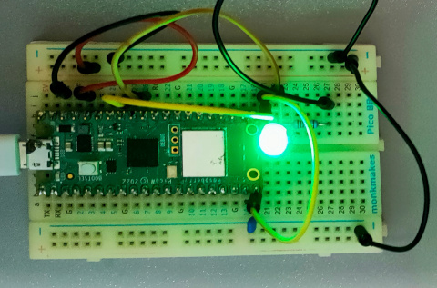
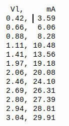
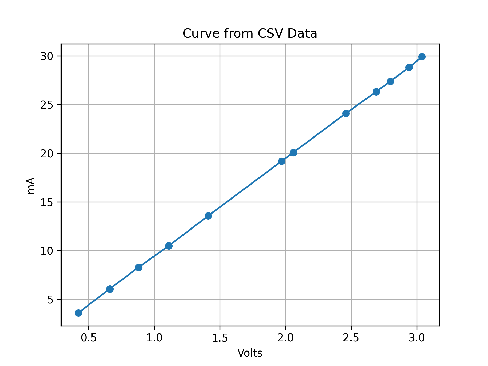

# LED Voltage-Current Measurement

## Overview
This directory contains code for measuring and analysing the voltage-current characteristics of LEDs using a Raspberry Pi Pico.

## Hardware Setup
The experiment uses:
- Raspberry Pi Pico, Pico W or Pico 2 with MicroPython
- PWM output (GPIO15) to control voltage
- Two ADC channels for voltage measurements
- A 100 ohm current-limiting resistor

## Files
- `pmw.py` - Main script for LED testing that:
    - Configures PWM output for voltage control
    - Sets up ADC inputs for measurement
    - Sweeps through voltage levels (1.0V to 3.3V)
    - Measures voltage across the LED and resistor
    - Calculates current at each voltage level
    - Outputs data suitable for plotting LED characteristics

## Usage
Run the script on a Raspberry Pi Pico with the proper circuit connections.

The output provides voltage and current measurements that can be used to plot the LED's I-V curve,
allowing analysis of forward voltage drop and other characteristics.

## More information
This code is part of a project which will be published on the [RAREblog stack](https://rareblog.substack.com).