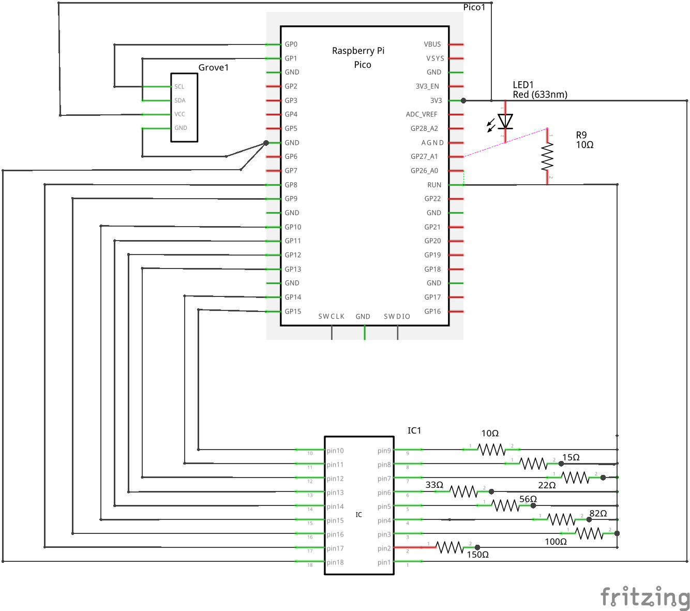

# LED Voltage-Current Measurement

## Overview
This directory contains code for measuring and analysing the voltage-current characteristics of LEDs using a Raspberry Pi Pico.

## Hardware Setup
The experiment uses:
- Raspberry Pi Pico, Pico W or Pico 2 with MicroPython
- A ULN2308A IC
- A Grove 1.22" monochrome OLED display
- A set of load resistors
- Jump wires, including a GROVE connector
- A red LED
- Two breadboards.

Here's the schematic:

## Files
- `darlington_loads.py` - Main script for LED testing that:
    - Sets up ADC inputs for measurement
    - Measures current though the LED for 8 load resistor values
    - Outputs data suitable for plotting LED characteristics
- `plotter.py` - the plot routine
- `sh1107.py` - the low-level drivet for the OLED display.

## Usage

Run the script on a Raspberry Pi Pico, Pico W or Pico 2 with the wiring shown above.

## More information

This code is part of a project which will be published on the [RAREblog stack](https://rareblog.substack.com).